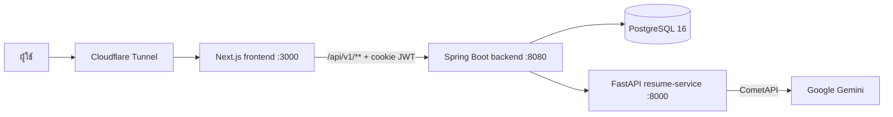

# ResuMate — AI_Project

**ระบบวิเคราะห์เรซูเม่และประเมินสมรรถนะเบื้องต้นเพื่อแนะนำสถานประกอบการสำหรับนักศึกษา**
โครงงานสาขาวิศวกรรมคอมพิวเตอร์ มหาวิทยาลัยเทคโนโลยีราชมงคลอีสาน วิทยาเขตขอนแก่น

นักศึกษาอัปโหลดเรซูเม่ → AI สกัดทักษะ → ทำแบบประเมินตนเอง → ได้คะแนน ที่มาของคะแนน สายงานที่เหมาะ 1–4 อันดับ ทักษะที่ขาด
และตำแหน่งฝึกงานที่ตรงกับทักษะ · บริษัทสมัครเป็นผู้ประกาศงานเอง (ผู้ดูแลระบบอนุมัติ) · รองรับ PDPA

---

## ฟีเจอร์หลัก

| กลุ่ม | ฟีเจอร์ |
|---|---|
| นักศึกษา | อัปโหลดเรซูเม่ (PDF) · แบบประเมินตนเอง · คะแนน + ที่มาของคะแนน · สายงานที่เหมาะ (% รวม 100) · จับคู่ทักษะด้วย LLM (ป้าย AI) · ตำแหน่งฝึกงานที่แนะนำ · ประวัติฝึกงาน · เครดิตรายเดือน |
| ผู้ประกาศงาน | สมัครเอง + รออนุมัติ · โปรไฟล์บริษัท · ประกาศงานพร้อมสถานะ/วันเปิด-ปิดอัตโนมัติ · อัปเดตสถานะผู้ฝึกงาน |
| ผู้ดูแลระบบ | อนุมัติผู้ประกาศงาน · จัดการบริษัท · นำเข้าบริษัทจาก CSV/XLSX (ตรวจก่อนบันทึก) · รายงานการใช้งาน + ต้นทุนต่อครั้ง (Cost per action) |
| PDPA | นโยบายความเป็นส่วนตัว + บันทึกความยินยอม · ถอนความยินยอม · ดาวน์โหลดข้อมูลของตัวเอง · ลบบัญชี |

## สถาปัตยกรรม



| ส่วน | เทคโนโลยี | โฟลเดอร์ / ไฟล์ | เอกสาร |
|---|---|---|---|
| Frontend | Next.js 16, React 19, TypeScript, Tailwind 4 | `frontend/` | [`frontend/README.md`](frontend/README.md) |
| Backend | Spring Boot 3.3, Java 21, PostgreSQL 16 | `backend/` | [`backend/README.md`](backend/README.md) |
| AI service | FastAPI + pdfplumber + PyThaiNLP → Gemini ผ่าน CometAPI | `main.py`, `requirements.txt` | [`backend/README.md`](backend/README.md) §1 |

**คะแนนทุกตัวคำนวณในฝั่ง Java** — LLM ใช้สกัดทักษะ ตัดสินคู่ทักษะที่ความหมายเดียวกัน และเรียบเรียงคำอธิบายเท่านั้น
สูตรคะแนนดู [`API_CHANGES.md`](API_CHANGES.md) §4

---

## รันทั้งระบบด้วย Docker

```bash
cp .env.example .env          # เติมค่าตาม .env.example (+ GOOGLE_OAUTH_CLIENT_ID ที่ docker-compose.yml ใช้)
cd backend && mvn clean package -DskipTests && cd ..   # Dockerfile ของ backend ก๊อป jar ที่ build แล้ว
docker compose up -d --build
```

| service | port |
|---|---|
| frontend | http://localhost:3000 |
| backend | http://localhost:8080 |
| resume-service (FastAPI) | http://localhost:8000 |
| postgres | 5432 |

production ใช้ `docker-compose.prod.yml` / `docker-compose.tunnel.yml` · ดึงงานล่าสุดจาก GitHub แล้ว build เฉพาะส่วนที่เปลี่ยนด้วย `sync-fe.ps1`

---

## เอกสาร

| ไฟล์ | เนื้อหา |
|---|---|
| [`API_CHANGES.md`](API_CHANGES.md) | API ทั้งหมดที่หน้าบ้านใช้ รอบ B1–B11 + error code + ตัวอย่าง body |
| [`TESTING_FLOWS.md`](TESTING_FLOWS.md) | ขั้นตอนทดสอบแต่ละ flow (นักศึกษา / ผู้ประกาศงาน / แอดมิน / สาธารณะ) |
| [`DEPLOY_CHANGES.md`](DEPLOY_CHANGES.md) | บันทึกการเตรียมระบบขึ้น production |
| [`docs/PRIVACY_POLICY_TH.md`](docs/PRIVACY_POLICY_TH.md) | ร่างนโยบายความเป็นส่วนตัว (ต้นฉบับของหน้า `/privacy-policy`) |
