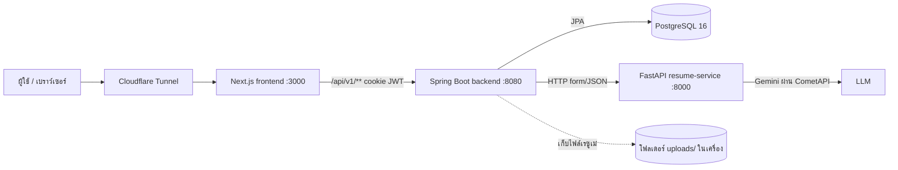
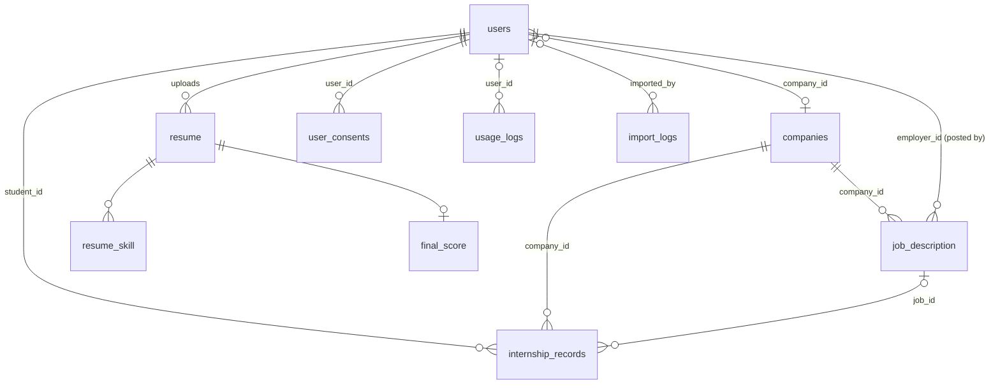

# ResuMate Backend

Spring Boot 3.3 / Java 21 / PostgreSQL 16 + FastAPI (`main.py`) สำหรับงานที่ต้องใช้ AI

เอกสารนี้อธิบายระบบหลังบ้าน วิธีรัน ค่าที่ตั้งได้ และ endpoint ทั้งหมดที่เพิ่มในรอบ B1–B11
(การเปลี่ยนแปลงฝั่ง API ที่หน้าบ้านต้องรู้ สรุปไว้ใน `../API_CHANGES.md`)

---

## 1. สถาปัตยกรรม



- **Controller → Service → Repository → Entity** แบ่งแพ็กเกจตามฟีเจอร์ (`company`, `assessment`, `resume`, `user`, `internship`, `importer`, `usage`, `platform`, `admin`)
- **ตัวเลขคะแนนทุกค่าคำนวณในฝั่ง Java** LLM มีหน้าที่แค่สกัดข้อมูล ตัดสินคู่ทักษะ และเรียบเรียงคำอธิบาย
- **JWT อยู่ใน HttpOnly cookie** `accessToken` อายุ 1 วัน

### เรื่องไฟล์ (S3)
ตอนนี้ไฟล์ PDF เก็บในโฟลเดอร์ `uploads/` ของเครื่องที่รัน backend ซึ่งพอสำหรับเครื่องเดียว
ถ้าจะขยายเป็นหลายเครื่องหรือย้ายขึ้น cloud ให้ย้ายไปเก็บที่ S3 หรือ Cloudflare R2 ดังนี้
1. แทนที่ตอนเขียนไฟล์ใน `ResumeService` ด้วยการอัปโหลดไป bucket ส่วนตัว (ปิด public access)
2. เก็บ object key ไว้ใน `resume.file_path` แทน path ในเครื่อง
3. ตอนให้ดาวน์โหลด ออก pre-signed URL อายุสั้น (เช่น 5 นาที) แทนการส่งไฟล์ผ่าน backend
4. ตอนลบบัญชี (`DELETE /users/me`) ให้ลบ object ใน bucket ด้วย (ตอนนี้ลบไฟล์ในเครื่องอยู่แล้ว)

### ข้อจำกัดที่ตั้งใจไว้ (เครื่องเดียว)
rate limit, cache และสถานะงานเบื้องหลัง (`/tasks`) เก็บในหน่วยความจำ ถ้ารีสตาร์ต backend ค่าเหล่านี้จะหายไป
ถ้ารันหลายเครื่องต้องย้ายไปใช้ Redis

---

## 2. ตารางในฐานข้อมูล

Hibernate สร้างตารางและคอลัมน์ใหม่ให้เองอัตโนมัติ (`ddl-auto=update`) คอลัมน์ใหม่ทุกตัวยอมให้เป็นค่าว่าง ข้อมูลเก่าจึงไม่พัง



| ตาราง | งาน | หมายเหตุ |
|---|---|---|
| `companies` | B4 | `tax_id` ห้ามซ้ำ, `status` = PENDING / ACTIVE / SUSPENDED / REJECTED |
| `job_description` (+คอลัมน์) | B3/B4 | `company_id`, `status` (DRAFT/OPEN/CLOSED), `open_date`, `close_date`, `created_at`, `updated_at` |
| `users` (+คอลัมน์) | B4/B5 | `company_id`, `account_status`, `status_reason` |
| `skill_match_cache` | B2 | ผลตัดสินของ LLM ต่อคู่ทักษะ (unique ต่อคู่) |
| `internship_records` | B6 | ประวัติฝึกงาน |
| `import_logs` | B7 | ประวัติการนำเข้าไฟล์ |
| `usage_logs` | B8 | การใช้งานฟีเจอร์ AI + เครดิต |
| `user_consents` | B9 | ประวัติการยอมรับหรือถอนความยินยอมตามนโยบาย |

Index ที่เพิ่ม: `job_description(status, company_id, employer_id)`, `companies(name_th, status)`,
`internship_records(student_id, company_id, status)`, `usage_logs(user_id+created_at, action)`,
`user_consents(user_id)`, `import_logs(created_at)`

### การย้ายข้อมูลเก่าอัตโนมัติ (`CompanyDataMigration`)
ทำงานทุกครั้งที่ backend เปิดขึ้น ถ้ารันซ้ำก็ไม่สร้างข้อมูลซ้ำ มี 3 ขั้น:
1. ประกาศงานที่ยังไม่มีสถานะ ตั้งเป็น OPEN
2. ประกาศงานที่ยังไม่มีบริษัท สร้างหรือหาบริษัทจาก `company_name` แล้วผูกให้
3. ผูก EMPLOYER เก่าเข้ากับบริษัทของประกาศที่เขาเคยลง

---

## 3. วิธีรัน

```powershell
# 1) build jar ในเครื่อง (Dockerfile ตอนนี้ก๊อปแค่ jar ที่ build แล้ว)
cd backend
mvn clean package -DskipTests
cd ..

# 2) build + รัน container
docker compose up -d --build --no-deps backend resume-service
docker compose logs -f backend
```

ถ้าแก้ `main.py` ต้อง build `resume-service` ใหม่ด้วย (มี endpoint ใหม่ 2 ตัวสำหรับ B1/B2)

Unit test (B1 การปัดเปอร์เซ็นต์):
```powershell
mvn -Dtest=CareerMatchCalculatorTest test
```

---

## 4. ค่าที่ตั้งได้ (`application.properties`)

| key | ค่าเริ่มต้น | ความหมาย |
|---|---|---|
| `app.matching.semantic.enabled` | `true` | B2 ถ้าตั้งเป็น false จะจับคู่ทักษะด้วยคำอย่างเดียวแบบเดิม |
| `app.jobs.status-cron` | `0 5 * * * *` | B3 เวลาที่ระบบเปิด/ปิดประกาศงานอัตโนมัติ (เวลาไทย) |
| `app.credits.monthly-limit` | `30` | B8 เครดิตต่อผู้ใช้ต่อเดือน (0 = ไม่จำกัด, ADMIN ไม่จำกัดเสมอ) |
| `app.credits.cost.RESUME_UPLOAD` | `1` | B8 เครดิตที่ใช้ต่อการอัปโหลดเรซูเม่ 1 ครั้ง |
| `app.credits.cost.ASSESSMENT_SUBMIT` | `1` | B8 เครดิตที่ใช้ต่อการส่งแบบประเมิน 1 ครั้ง |
| `app.policy.version` | `1.0` | B9 เวอร์ชันนโยบายปัจจุบัน ถ้าเปลี่ยน ผู้ใช้ทุกคนต้องกดยอมรับใหม่ |
| `app.policy.enforce-on-register` | `false` | B9 ถ้าเป็น true การสมัครต้องส่ง `acceptedPolicyVersion` ให้เปิดหลังหน้าบ้านมี checkbox แล้วเท่านั้น |
| `app.retention.usage-log-days` | `365` | B9 ลบ usage log ที่เก่ากว่านี้ทุกวันตี 3 |
| `app.ratelimit.*-per-minute` | 10 / 6 / 5 | B10 จำนวนครั้งต่อ IP ต่อนาที สำหรับกลุ่ม auth / AI / import |

---

## 5. Endpoint ใหม่ทั้งหมด

รูปแบบ error ทุกตัวเป็น `{"status":4xx,"code":"...","message":"..."}`

### B1 careerMatches
ไม่มี endpoint ใหม่ ผลอยู่ใน `POST /api/v1/assessments/submit` ช่อง `careerMatches` จะมีเฉพาะตอนผู้ใช้**ไม่ได้กรอก**ตำแหน่งงาน
- ได้ 1–4 อาชีพ เปอร์เซ็นต์รวมกันได้ 100 พอดี โดยปัดเศษแบบ largest remainder (`CareerMatchCalculator`)
- แต่ละอาชีพมี `matchedSkills` และ `missingSkills` (แสดงไม่เกิน 10 รายการ)
- วิธีคำนวณ: LLM เสนอชื่ออาชีพมา แต่ Java คิดเปอร์เซ็นต์เองจาก resumeScore ของแต่ละอาชีพ อาชีพที่ไม่มีทักษะตรงเลยจะถูกตัดออก

### B2 Semantic skill matching
ไม่มี endpoint ใหม่ สำหรับทักษะในเรซูเม่แต่ละตัว ระบบทำตามลำดับนี้:
1. ลองจับคู่ด้วยคำแบบเดิมก่อน ถ้าตรงก็ใช้เลย
2. ถ้าไม่ตรง คัดทักษะมาตรฐานที่ใกล้ที่สุด 6 ตัวด้วยความคล้ายของตัวอักษร (trigram)
3. ดูใน `skill_match_cache` ก่อน คู่ไหนยังไม่มีผลค่อยส่งให้ LLM ตัดสิน แล้วเก็บผลลง cache
4. ถ้า Python หรือ LLM ล่ม จะถอยกลับไปใช้ผลของขั้น 1 อย่างเดียว

ผลจะอยู่ใน `scoreBreakdown.matchDetails` (บอกว่าแต่ละทักษะจับคู่กับอะไร ด้วยวิธี WORD / SEMANTIC / NONE) และ `scoreBreakdown.matchMethod`

> **ข้อจำกัดที่ต้องบอกตรง ๆ:** ขั้น retrieval ใช้ความคล้ายของตัวอักษร ไม่ใช่ embedding
> เพราะโปรเจกต์เพิ่ม library ใหม่ไม่ได้ ถ้าวันหน้าจะเพิ่ม embedding ให้แก้แค่ `SemanticSkillMatcher.applySemantic` ขั้นที่ 1

### B3 สถานะประกาศงาน
| method | path | ใคร |
|---|---|---|
| GET | `/api/v1/workplaces` | ทุกคน เห็นเฉพาะ OPEN, `?status=ALL` ใช้ได้เฉพาะ EMPLOYER/ADMIN, ส่ง `?page=&size=&q=` จะได้ผลแบบแบ่งหน้า |
| PATCH | `/api/v1/jobs/{id}/status` | เจ้าของประกาศ คนในบริษัทเดียวกัน หรือ ADMIN body: `{"status":"OPEN\|CLOSED\|DRAFT","openDate":"2026-10-01","closeDate":"2026-11-30"}` |

ตัวตั้งเวลาทำ 2 อย่าง: เปิดประกาศ DRAFT ที่ถึงวันเปิดแล้ว และปิดประกาศ OPEN ที่เลยวันปิดแล้ว ส่วนการจับคู่งาน (`/matching`) จะข้ามประกาศที่ไม่ใช่ OPEN

### B4 บริษัท
| method | path | ใคร |
|---|---|---|
| GET | `/api/v1/companies/{id}` | ทุกคน (ไม่แสดงเลขผู้เสียภาษี) |
| GET | `/api/v1/companies/{id}/jobs` | ทุกคน |
| GET / PUT | `/api/v1/companies/me` | EMPLOYER |
| GET / POST | `/api/v1/admin/companies` | ADMIN, GET ใส่ `?status=&q=&page=&size=` ได้ |
| GET / PUT / DELETE | `/api/v1/admin/companies/{id}` | ADMIN |
| PATCH | `/api/v1/admin/companies/{id}/status` | ADMIN body: `{"status":"SUSPENDED","reason":"..."}` |
| POST | `/api/v1/admin/companies/{id}/users/{userId}` | ADMIN ผูกผู้ใช้เข้ากับบริษัท |

`POST /api/v1/jobs` เอาผู้ลงประกาศจาก token เสมอ และใช้บริษัทของผู้ใช้คนนั้น (นักศึกษาลงประกาศไม่ได้)

### B5 สมัครเป็นผู้ประกาศงาน
- `POST /api/v1/auth/register` ส่ง `role:"EMPLOYER"` พร้อม `companyName` (และ `companyTaxId` ถ้ามี) ได้ 201 กลับมาพร้อม `code:"EMPLOYER_PENDING"` และ**ไม่มี cookie**
- ส่ง `role:"ADMIN"` → 403 `ROLE_NOT_ALLOWED`
- login ระหว่างรออนุมัติ → 403 `EMPLOYER_PENDING`, ถูกปฏิเสธ → 403 `EMPLOYER_REJECTED`, ถูกระงับ → 403 `ACCOUNT_SUSPENDED`

| method | path |
|---|---|
| GET | `/api/v1/admin/employers?status=PENDING\|ACTIVE\|REJECTED\|ALL` |
| POST | `/api/v1/admin/employers/{userId}/approve` |
| POST | `/api/v1/admin/employers/{userId}/reject` body: `{"reason":"..."}` |
| POST | `/api/v1/admin/employers/{userId}/suspend` body: `{"suspended":true,"reason":"..."}` |

### B6 ประวัติฝึกงาน
| method | path | ใคร |
|---|---|---|
| GET / POST | `/api/v1/internships/me` | นักศึกษา |
| PUT / DELETE | `/api/v1/internships/me/{id}` | นักศึกษา (ลบได้เฉพาะรายการสถานะ APPLIED/CANCELLED) |
| GET | `/api/v1/employer/internships` | EMPLOYER (เห็นเฉพาะของบริษัทตัวเอง) |
| PATCH | `/api/v1/employer/internships/{id}` | EMPLOYER body: `{"status":"ACCEPTED","companyNote":"..."}` |
| GET | `/api/v1/admin/internships?status=&companyId=&page=&size=` | ADMIN |

สถานะมี APPLIED, ACCEPTED, IN_PROGRESS, COMPLETED, CANCELLED, REJECTED

### B7 นำเข้าบริษัทจากไฟล์
| method | path |
|---|---|
| GET | `/api/v1/admin/companies/import/template` ได้ไฟล์ CSV ตัวอย่าง |
| POST | `/api/v1/admin/companies/import?dryRun=true` แนบไฟล์ใน form-data ช่อง `file` (.csv/.xlsx ไม่เกิน 5 MB และ 5,000 แถว) |
| GET | `/api/v1/admin/imports?page=&size=` ดูประวัติการนำเข้า |

- ค่าเริ่มต้นคือ `dryRun=true` คือตรวจอย่างเดียว ยังไม่บันทึก ถ้าผลถูกต้องให้ส่งซ้ำด้วย `dryRun=false`
- การ upsert: หาบริษัทด้วย `tax_id` ก่อน ถ้าไม่มีเลขภาษีค่อยหาด้วย `name_th` เจอแล้วจะอัปเดตเฉพาะช่องที่มีค่า
- หัวคอลัมน์ใช้ได้ทั้งไทยและอังกฤษ (ดูใน `ImporterConfig`) ถ้าจะนำเข้าข้อมูลชนิดใหม่ ให้เพิ่ม config ชุดใหม่

### B8 การใช้งานและเครดิต
- `GET /api/v1/users/me/credits` ได้ `{monthlyLimit, used, remaining, resetAt, costs}` กลับมา
- อัปโหลดเรซูเม่หรือส่งแบบประเมินตอนเครดิตไม่พอ → 429 `CREDITS_EXHAUSTED` เครดิตถูกหักเฉพาะตอนทำสำเร็จ
- `GET /api/v1/admin/usage?userId=&action=&from=2026-09-01&to=2026-09-30&page=&size=` สำหรับ ADMIN
- `GET /api/v1/admin/usage/summary?from=&to=` สำหรับ ADMIN

### B9 PDPA
| method | path |
|---|---|
| GET | `/api/v1/policies/current` (ทุกคน) |
| GET / POST / DELETE | `/api/v1/users/me/consents` POST body: `{"version":"1.0"}` |
| GET | `/api/v1/users/me/data-export` ได้ไฟล์ JSON ข้อมูลทั้งหมดของผู้ใช้ |
| DELETE | `/api/v1/users/me` บัญชีปกติส่ง body `{"password":"..."}` บัญชี Google ส่ง `{"confirm":"อีเมลตัวเอง"}` |

- ผลของ login และ `/auth/me` มีช่อง `needsConsent` ถ้าเป็น true ให้หน้าบ้านแสดงหน้ากดยอมรับนโยบาย
- การลบบัญชีจะลบเรซูเม่พร้อมไฟล์ คะแนน คำตอบ ประวัติฝึกงาน และ consent ทั้งหมด ส่วน usage log ยังเก็บไว้แต่ตัดชื่อผู้ใช้ออก และประกาศงานยังอยู่แต่ไม่ผูกกับบัญชีแล้ว

### B10 ประสิทธิภาพและความปลอดภัย
- **แบ่งหน้า**: `/workplaces?page=`, `/admin/companies`, `/admin/internships`, `/admin/usage`, `/admin/imports` ส่งผลกลับมาในรูป `{content, page, size, totalElements, totalPages}`
- **Cache**: เก็บทักษะมาตรฐานของแต่ละตำแหน่ง (`standardSkills`) และผลตัดสินคู่ทักษะของ LLM (`skill_match_cache`)
- **งานเบื้องหลัง**: `POST /api/v1/assessments/submit?async=true` ตอบ 202 พร้อม `{taskId}` ทันที แล้วให้ poll `GET /api/v1/tasks/{taskId}` จน `status` เป็น DONE หรือ FAILED
- **Rate limit**: นับต่อ IP ต่อนาที เกินแล้วได้ 429 `RATE_LIMITED` พร้อม header `Retry-After`

### เพิ่มเติม (24 ก.ย. 2569)
- **Cost per action**: `main.py` นับ token ทุกครั้งที่เรียก Gemini แล้วส่งกลับทาง header `X-LLM-Input-Tokens` / `X-LLM-Output-Tokens` / `X-LLM-Calls` / `X-LLM-Model` ส่วน `TokenMeter` (Java) รวมยอดต่อ 1 action แล้วบันทึกลง `usage_logs` (`input_tokens`, `output_tokens`, `llm_model`, `token_breakdown`) ดูรายงานได้ที่ `GET /api/v1/admin/usage/cost` ราคาตั้งที่ `app.llm.price.*`
- **`careerMatches[].roleNameTh`**: ชื่อสายงานภาษาไทยจาก `infer-roles-from-skills`
- **`requiredSkillsDetail`**: ใน `/workplaces` เมื่อผู้ใช้ล็อกอินอยู่ เทียบทักษะของงานกับเรซูเม่ล่าสุดด้วยการจับคู่ด้วยคำ (`JobSkillAnnotator`)
- ร่างนโยบายความเป็นส่วนตัว: `docs/PRIVACY_POLICY_TH.md`
